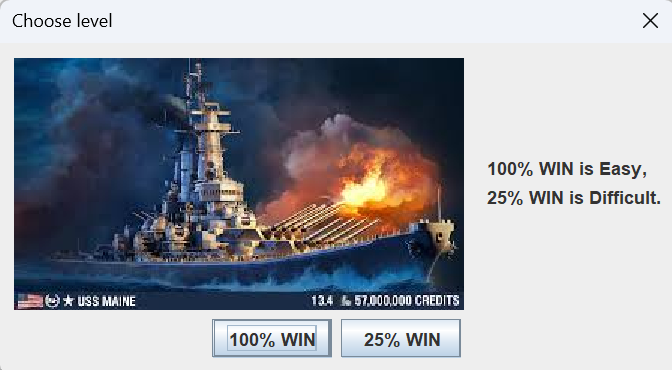
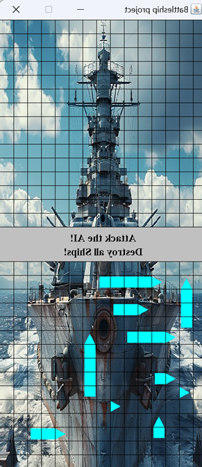
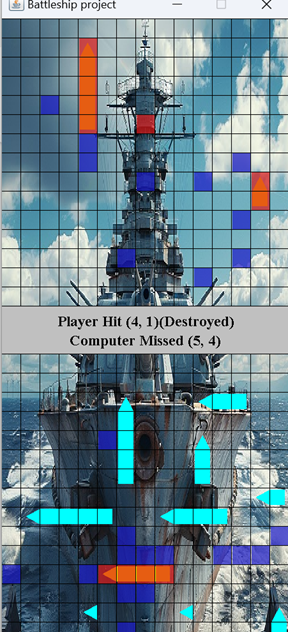

🛳️ Battleship - Java AI-Based Game
Student Name: Tô Duy Thịnh
Student ID: ITCSIU22138

🎮 Overview
Battleship is a turn-based strategic game where the player faces off against a computer-controlled opponent (AI) to locate and destroy all enemy ships. This Java implementation supports multiple AI levels and includes keyboard and mouse interaction within a graphical UI using Java Swing.

📜 Game Rules
Each player has a grid and places 10 ships:
Lengths: 5, 5, 4, 4, 3, 3, 2, 2, 1, 1

Ships can be placed horizontally or vertically.

After ship placement, players alternate turns to attack a single cell on the opponent’s grid.

Grid markers:

Red: Hit a ship

Blue: Miss (empty water)

Ships are revealed when completely destroyed.

The game ends when one player loses all ships.

🕹️ Controls

General Controls
1 - Quit game

2 - Restart game

4 - Toggle debug mode (cheat: show AI ships)

Placement Phase
Mouse Click - Place ship (if valid)

3 - Rotate ship (horizontal/vertical)

Attack Phase
Mouse Click - Select a cell to attack (if not already attacked)

🧠 AI Difficulty Modes
On game launch, a dialog prompts the user to select AI difficulty:

Easy (100% WIN): Random attack patterns

Hard (25% WIN): Smarter AI strategy

🔍 Algorithms & Complexity
Functionality	Algorithm Type	Complexity
Generate Valid AI Moves	Grid iteration	O(WIDTH × HEIGHT)
Place Ship Randomly	Backtracking	Depends on attempts
Check Ship Placement	Linear check	O(ship segments)
AI Shuffle (SimpleRandom)	Randomization	O(n)